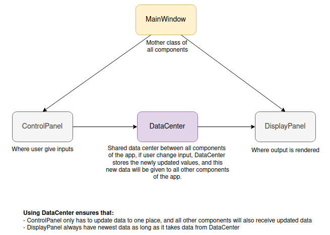
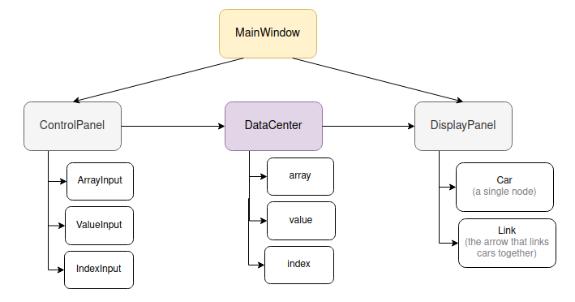

# Linked List Visualizer

Visualizing linked list `add` and `delete` operation using Java Swing UI
library.

## Developer setup

**Requirements**: Java 17, VSCode (or any IDE of choice)

1.  Ask @lanphgphm to be added as project collaborator.

2.  Clone this repository with:

    `git clone https://github.com/lanphgphm/linked-list-visualizer.git`

    Create your own branch and switch to it with:

    `git checkout -b <branch name>`

3.  Start adding code!

    All code files should begin with these imports:

    ```java
    import javax.swing.*;
    import java.awt.*;
    ```

4.  Run the app

    - Open the project in your IDE. If you are using VSCode, right click
      on project folder and choose "Open with VSCode." This ensures that
      you enter the right environment.

      Inside VSCode, start the app by clicking the "Run" button, or open
      terminal and type

      `mvn exec:java`

      the app should render like a regular desktop app.

    - If you do not have an IDE or just want to try the application ASAP, head to [target](./target/) and double-click on `linkedListVisualizer-1.0-SNAPSHOT-jar-with-dependencies.jar` and the app should run normally
    - You can also run this command in the terminal

      ```
      cd linked-list-visualizer
      java -jar .\target\linkedListVisualizer-1.0-SNAPSHOT-jar-with-dependencies.jar
      ```

5.  Push your code to this repository

    Before pushing, always pull any changes from upstream with:

    `git pull`

    Then, stage, commit, and push your code:

    `git add .`

    `git commit -m "<commit message>"`

    `git push -u origin <branch name>` (first time), or `git push` (not first time)

## Project structure

On an overview, the app has 3 main components: ControlPanel, DisplayPanel,
and a DataCenter that acts as the shared state. This shared state stores
user's data update (when they modify the array, value, or index), and helps
2 panels communicate with each other.


Smaller classes (i.e., classes that are not MainWindow, ControlPanel,
or DisplayPanel) are created to serve one of these 3 main components.
Each folder contains several classes that belongs to the same component,
i.e. a LinkedList component needs to have the node (Car), and the Link,
so Link and Car are in the same folder "LL".


Current folder structure, and what each folder should contain:

```
   src
    |
    |_main
       |
       |_java/com/linkedlistvisualizer
       |    |
       |    |_MainWindow.java
       |    |  (Mother component to call ControlPanel and DisplayPanel)
       |    |
       |    |_DataCenter.java
       |    |  (Shared state to store app's data--similar to React Redux store)
       |    |
       |    |_Styles.java
       |    |  (Store all functions to style the app--similar to .css file)
       |    |
       |    |_components
       |      (All other components of the app goes here)
       |        |_layout
       |        | (Manage app layout)
       |        |   |_ControlPanel
       |        |   |   |_ControlPanel.java
       |        |   |   |_DeleteButton.java
       |        |   |   |_InsertButton.java
       |        |   |   |_ResetButton.java
       |        |   |   |_SetArrayButton.java
       |        |   |
       |        |   |_Sudoku
       |        |   |   |_ClearSudokuButton.java
       |        |   |   |_RandomImage.java
       |        |   |   |_SolveSudokuButton.java
       |        |   |   |_SudokuNotiPanel.java
       |        |   |   |_SudokuPanel.java
       |        |   |
       |        |   |_DisplayPanel.java
       |        |
       |        |_LL
       |         (Components that makes a linked list)
       |           |_Car.java
       |           |_LeftToRightLink.java
       |           |_RightToLeftLink.java
       |
       |
       |_resources
            |
            |_(Stores app images, icons, etc.)
```

## User installation

Currently, this product is not done therefore it is not shippable to
users :)

Desktop installation guide would be updated in due time.

##

**Last edited**: May 08, 2024 by LP, Sid, Tan, Huy, Cong Thanh.
