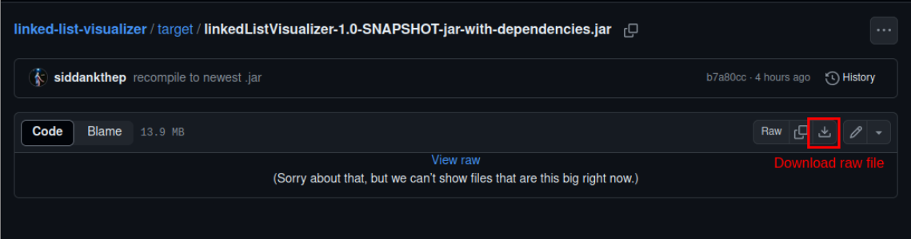
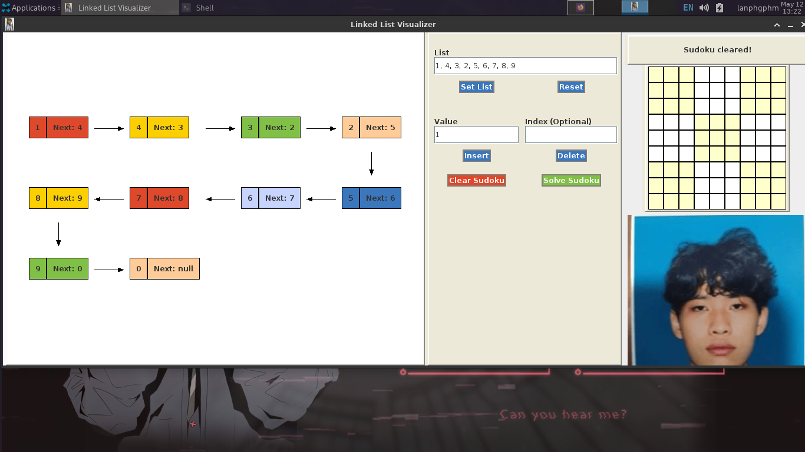
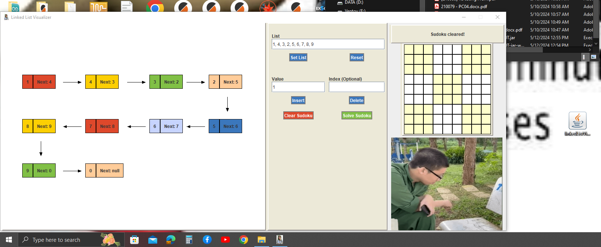
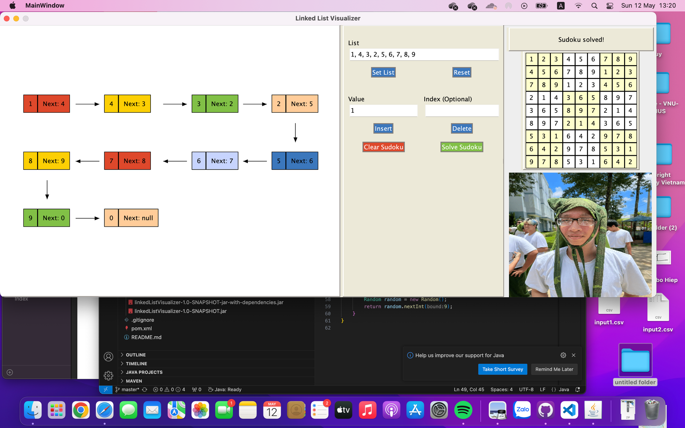
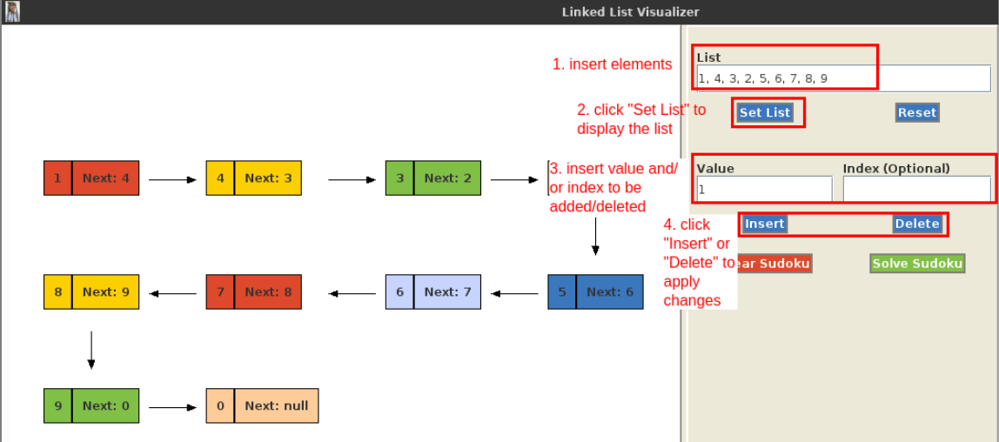
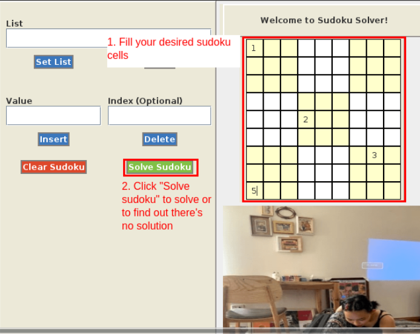
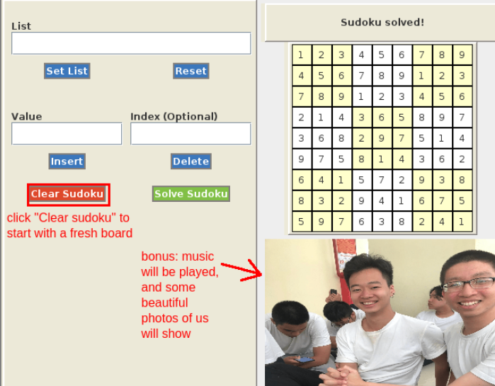

# Linked List Visualizer & Sudoku Solver

Visualizing linked list `add` and `delete` operation, solving Sudoku boards using Java Swing UI library.

The Java Swing components that we used the most are: 
- JPanel: JPanel is a versatile semantic ccomponent that is used to mark an area of the viewport. We use JPanel to create the layouts, the Sudoku board, the notification panel, even each component of the linked list is also a JPanel.
- JButton: which allows for user interation with the app (set list, clear sudoku, etc.) and waits for events to trigger some actions.
- Layout components (GridLayout, FlowLayout): which is used to control how each component is placed in one panel.

## User installation
Users can run this project by running the `.jar` file.
1. Go to https://github.com/lanphgphm/linked-list-visualizer/blob/master/target/linkedListVisualizer-1.0-SNAPSHOT-jar-with-dependencies.jar
2. Select "Download raw file" 
 
3. Double click on the `linkedListVisualizer-1.0-SNAPSHOT-jar-with-dependencies.jar` file to run the app. This file runs the same on all operating system, thanks to the "Write Once, Run Everywhere" philosophy of Java. 
On GNU-Linux: 
 
On Microsoft Windows: 
 
On MacOS: 

4. The app has 2 main functions: 
- Visualize linked list add and delete operations.
    - Type in your list, each element must be a number, separated by a comma.
    - Click "Set List" to display the list with those elements.
    - Input element and index to add or delete. 
    - Click "Insert" or "Delete" to see the list after the operation.
    - Click "Reset" to clear the list.
    
- Solve 9x9 sudoku. 
    - Input some numbers on the sudoku board. 
    - Click "Solve sudoku" to see the solution.
    - Click "Clear sudoku" to clear the board.
    
    
- Random music and photos will be displayed to add some fun to the user experience. 

## Developer setup

**Requirements**: Java 17 (the Java Development Kit), VSCode (or any IDE of choice)

1.  Ask @lanphgphm to be added as project collaborator.

2.  Clone this repository with:

    `git clone https://github.com/lanphgphm/linked-list-visualizer.git`

    Create your own branch and switch to it with:

    `git checkout -b <branch name>`

3.  Start adding code!

    All code files should begin with these imports:

    ```java
    import javax.swing.*;
    import java.awt.*;
    ```

4.  Run the app

    - Open the project in your IDE. If you are using VSCode, right click
      on project folder and choose "Open with VSCode." This ensures that
      you enter the right environment.

      Inside VSCode, start the app by clicking the "Run" button, or open
      terminal and type

      `mvn exec:java`

      the app should render like a regular desktop app.

    - If you do not have an IDE or just want to try the application ASAP, head to [target](./target/) and double-click on `linkedListVisualizer-1.0-SNAPSHOT-jar-with-dependencies.jar` and the app should run normally
    - You can also run this command in the terminal

      ```
      cd linked-list-visualizer
      java -jar .\target\linkedListVisualizer-1.0-SNAPSHOT-jar-with-dependencies.jar
      ```

5.  Push your code to this repository

    Before pushing, always pull any changes from upstream with:

    `git pull`

    Then, stage, commit, and push your code:

    `git add .`

    `git commit -m "<commit message>"`

    `git push -u origin <branch name>` (first time), or `git push` (not first time)

## Project structure

On an overview, the app has 3 main components: ControlPanel, DisplayPanel,
and a DataCenter that acts as the shared state. This shared state stores
user's data update (when they modify the array, value, or index), and helps
2 panels communicate with each other.


Smaller classes (i.e., classes that are not MainWindow, ControlPanel,
or DisplayPanel) are created to serve one of these 3 main components.
Each folder contains several classes that belongs to the same component,
i.e. a LinkedList component needs to have the node (Car), and the Link,
so Link and Car are in the same folder "LL".


Current source code folder structure, and what each folder should contain:

```
   src
    |
    |_main
       |
       |_java/com/linkedlistvisualizer
       |    |
       |    |_MainWindow.java
       |    |  (Mother component to call ControlPanel and DisplayPanel)
       |    |
       |    |_DataCenter.java
       |    |  (Shared state to store app's data--similar to React Redux store)
       |    |
       |    |_Styles.java
       |    |  (Store all functions to style the app--similar to .css file)
       |    |
       |    |_components
       |      (All other components of the app goes here)
       |        |_layout
       |        | (Manage app layout)
       |        |   |_ControlPanel
       |        |   |   |_ControlPanel.java
       |        |   |   |_DeleteButton.java
       |        |   |   |_InsertButton.java
       |        |   |   |_ResetButton.java
       |        |   |   |_SetArrayButton.java
       |        |   |
       |        |   |_Sudoku
       |        |   |   |_ClearSudokuButton.java
       |        |   |   |_RandomImage.java
       |        |   |   |_SolveSudokuButton.java
       |        |   |   |_SudokuNotiPanel.java
       |        |   |   |_SudokuPanel.java
       |        |   |
       |        |   |_DisplayPanel.java
       |        |
       |        |_LL
       |         (Components that makes a linked list)
       |           |_Car.java
       |           |_LeftToRightLink.java
       |           |_RightToLeftLink.java
       |
       |
       |_resources
            |
            |_(Stores app images, icons, etc.)
```

**Last edited**: May 16, 2024. This project will no longer be developed or maintained. 
